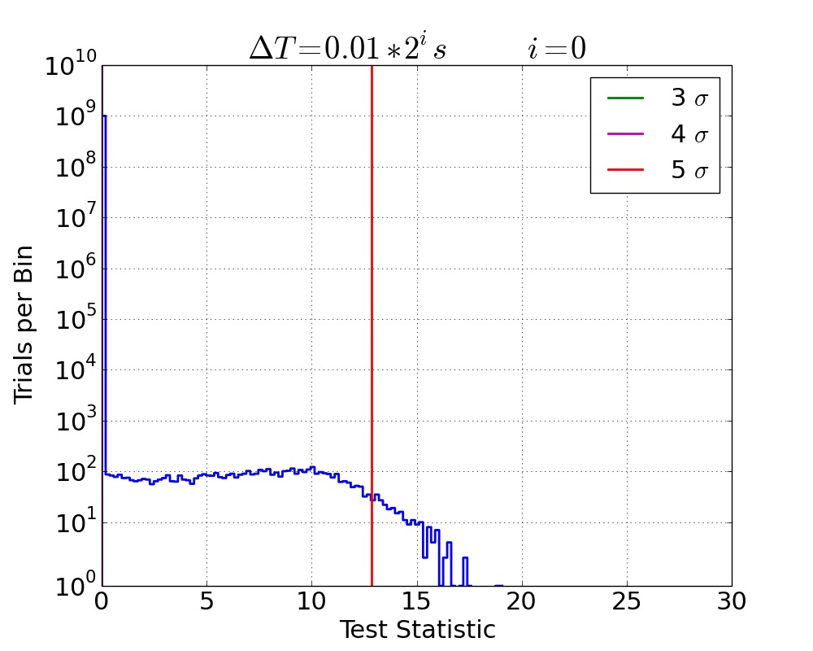

# Plots and scripts for Ph.D. thesis

## Explaining the spatial likelihood calculation

* sky_background.py (shown)
* convolution_bg.py (shown)
* convolution_src.py

## Evolution of test statistic distribution (TSD)

